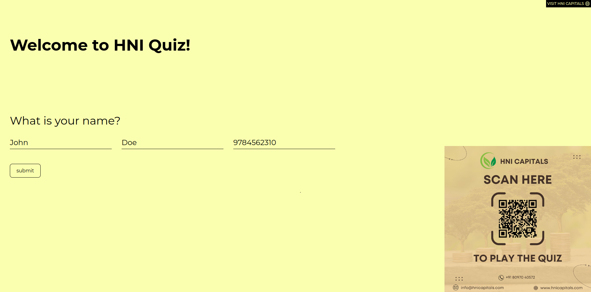
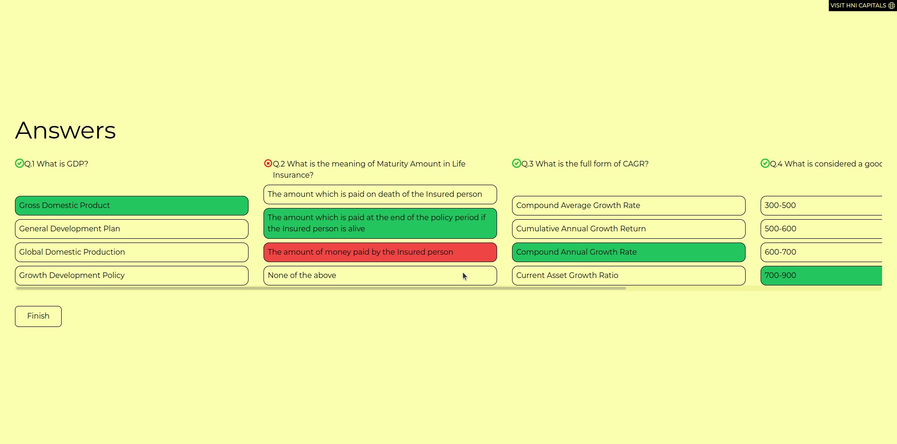

# HNI QUIZ

## The App

**Project:** React-based web application in which users play a short quiz of 5 questions based on finance, after finishing the game users is rewarded with stars w.r.t correct answers.

## Features:

-   **User Data Collection**
    -   App collects users name and conctact which is stored in firebase's firestore database. Which can lead to potential clients.
-   **Quiz**
    -   Quiz generated 5 random finance questions.
    -   Each question has multiple choices which users can select as a correction answer.
    -   After finishing the quiz user is rewarded with stars equal to correct answers given.
-   **Responsive Design:**
    -   The application is fully responsive to various screen widths.

## Tech Used

`HTML`
`Tailwind`
`REACT JS`
`REACT ROUTER DOM`
`Firebase`
`Firestore`

-   <a href="https://hni-quiz-git-personalusers-abhay-s-projects-389be7f0.vercel.app/" target="_blank">Click here for demo</a>

**Had fun building!** 🚀

